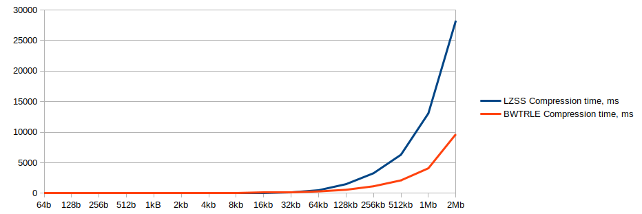

# Test documentation

## Unit test coverage
The unit test coverage is reported in CodeCov [](https://codecov.io/gh/shlevanto/tiralabra-2022)

## What has been tested
Unit tests will cover basic functionalities
- encoding results in a byte array with length > 0
- the encoded file is not larger than the original
- a string is encoded and decoded, the decoded matches the original

FileIO has tests for succesfully reading and writing files and throwing exceptions when this fails.

Main and UI are excluded from test coverage. I have not written tests for the Service class as all it does is run the different compressors.

## Performance tests
For performance testing different size samples of the same text were used. The text used was the [King James Bible](https://www.gutenberg.org/cache/epub/10/pg10.txt) from the Project Gutenberg site. The results are shown in the table and graphs below.

|       | LZSS              | BWTRLE            | LZSS                 | BWTRLE               | LZSS                   | BWTRLE                 |
|-------|-------------------|-------------------|----------------------|----------------------|------------------------|------------------------|
| size  | Compression ratio | Compression ratio | Compression time, ms | Compression time, ms | Decompression time, ms | Decompression time, ms |
| 64b   | 1                 | 0.98              | 0                    | 18                   | 0                      | 5                      |
| 128b  | 0.98              | 0.98              | 0                    | 0                    | 0                      | 2                      |
| 256b  | 0.99              | 0.97              | 0                    | 1                    | 0                      | 3                      |
| 512b  | 0.9               | 0.92              | 0                    | 1                    | 0                      | 3                      |
| 1kB   | 0.85              | 0.84              | 1                    | 5                    | 0                      | 6                      |
| 2kb   | 0.68              | 0.70              | 2                    | 13                   | 1                      | 13                     |
| 4kb   | 0.62              | 0.61              | 6                    | 33                   | 2                      | 24                     |
| 8kb   | 0.60              | 0.62              | 18                   | 50                   | 2                      | 29                     |
| 16kb  | 0.65              | 0.67              | 55                   | 129                  | 4                      | 38                     |
| 32kb  | 0.63              | 0.67              | 152                  | 185                  | 5                      | 44                     |
| 64kb  | 0.64              | 0.69              | 499                  | 306                  | 3                      | 86                     |
| 128kb | 0.63              | 0.71              | 1493                 | 572                  | 3                      | 74                     |
| 256kb | 0.62              | 0.72              | 3279                 | 1144                 | 5                      | 92                     |
| 512kb | 0.58              | 0.69              | 6308                 | 2113                 | 12                     | 173                    |
| 1Mb   | 0.58              | 0.69              | 13088                | 4092                 | 25                     | 338                    |
| 2Mb   | 0.60              | 0.71              | 28273                | 9671                 | 61                     | 815                    |


We see that both algorithms reach their optimal compression at around 4-8kb and the compression rate stays quite stable from there on. LZSS is better at encoding which is understandable as BWTRLE is not optimal for text and would benefit from having a small alphabet with lots of repeatability.



The compression time for LZSS starts off a bit faster than BWTRLE, but increases much more quickly when the text size grows. Although the time complexity for both is n log n, LZSS has a bigger range that it scans for each encoding compared to BWT which only sorts a set sized chunk of characters / bytes. 


LZSS is in turn much more efficient in decoding. LZSS decompression has time complexity O(log n) which clearly shows herewhereas BWT has to sort each set size chunk in every case with time complexity O(n log n).


### Test repeatability
Performance tests can be run using any text file in the root folder of the project or in the folder the jar -file is run from. The performance tests are run by adding the flag ```--performance``` when running the compression program.
